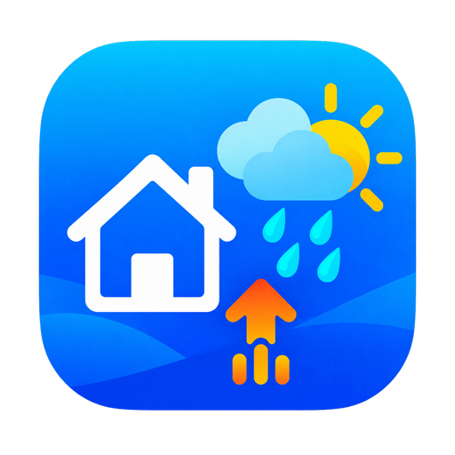

<p align="center">
  
</p>

# Home Assistant Weather Underground Uploader

[](https://github.com/pokornyIt/home-assistant-weather-underground-uploader/actions/workflows/ci.yml)
[](https://github.com/pokornyIt/home-assistant-weather-underground-uploader/actions/workflows/hassfest.yml)
[](https://github.com/pokornyIt/home-assistant-weather-underground-uploader/actions/workflows/hacs.yml)
[](https://github.com/pokornyIt/home-assistant-weather-underground-uploader/blob/main/LICENSE)

Upload a virtual Personal Weather Station assembled from arbitrary Home
Assistant entities to Weather Underground.

The integration is hardware- and vendor-independent. Temperature can come from
a Zigbee sensor, pressure from ESPHome, wind from Ecowitt, and rainfall from a
template or helper. Each mapped value is read, validated, normalized, and sent
as one virtual station observation.

## Requirements

- Home Assistant 2026.7 or newer;
- HACS for the recommended installation method;
- an existing Weather Underground Personal Weather Station (PWS);
- the Station ID and Station Key assigned to that PWS.

The integration uploads observations only. It does not register a Weather
Underground station or read observations and forecasts from Weather
Underground.

## Installation

### HACS

[](https://my.home-assistant.io/redirect/hacs_repository/?owner=pokornyIt&repository=home-assistant-weather-underground-uploader&category=integration)

1. Open the link above, or open HACS and select **Custom repositories**.
2. Add
   `https://github.com/pokornyIt/home-assistant-weather-underground-uploader`
   with the **Integration** category.
3. Select **Weather Underground Uploader** and install the latest release.
4. Restart Home Assistant when HACS asks you to.

### Manual installation

1. Download a source archive from the latest GitHub Release.
2. Copy the
   `custom_components/weather_underground_uploader` directory into the
   `custom_components` directory of your Home Assistant configuration.
3. Restart Home Assistant.

The final path must be:

```text
<config>/custom_components/weather_underground_uploader/manifest.json
```

## Configure a station

1. In Home Assistant, open **Settings > Devices & services**.
2. Select **Add integration** and search for **Weather Underground Uploader**.
3. Enter the Weather Underground **Station ID** and **Station Key**.
4. Open the new integration entry and select **Configure**.
5. Choose an upload interval and map the available Home Assistant entities.

The device name and area screen shown by Home Assistant does not configure
measurement sources. Open **Configure** on the integration entry after setup to
select them. An unmapped station remains idle and does not schedule upload
attempts. Saving the first mapping performs an immediate upload and starts the
configured interval.

The Station ID is normalized to uppercase and is the stable identifier for the
config entry. The same Station ID cannot be configured twice. The Station Key
is stored as a secret and is never included in logs or downloaded diagnostics.

Use **Reconfigure** on an existing integration entry to rotate its Station Key
or change its Station ID without losing entity mappings and options. A changed
Station ID must not already belong to another entry. When a currently valid
mapped measurement is available, reconfiguration validates the new credentials
with one upload before saving; a rejected or failed validation leaves the
existing configuration unchanged.

All measurement mappings are optional, but an active station requires at least
one mapping and an upload requires at least one currently valid mapped value.
The default upload interval is 300 seconds and can be set from 60 to 3,600
seconds.

## Virtual stations and multiple stations

One config entry represents exactly one Weather Underground PWS. Its mapped
entities do not need to belong to one Home Assistant device or source
integration. This is the virtual-station model: the resulting Weather
Underground observation is composed only when an upload is due.

Add the integration again with a different Station ID to operate another PWS.
Every station has independent credentials, mappings, upload interval,
coordinator, status entities, and reauthentication flow.

## Supported measurements

The integration relies on each entity's numeric state and declared
`unit_of_measurement`. It uses Home Assistant's native unit converters and sends
the Weather Underground protocol fields shown below.

| Mapping | Expected source semantics | Accepted source unit | WU field and output unit |
| --- | --- | --- | --- |
| Outdoor temperature | Current outdoor air temperature | Any temperature unit supported by Home Assistant | `tempf`, °F |
| Relative humidity | Current outdoor relative humidity, 0–100 | `%` or no unit | `humidity`, % |
| Barometric pressure | Current atmospheric pressure | Any pressure unit supported by Home Assistant | `baromin`, inHg |
| Dew point | Current outdoor dew-point temperature | Any temperature unit supported by Home Assistant | `dewptf`, °F |
| Wind direction | Current direction in degrees, 0–360 | `°` or no unit | `winddir`, degrees |
| Wind speed | Current sustained wind speed | Any speed unit supported by Home Assistant | `windspeedmph`, mph |
| Wind gust | Current gust speed | Any speed unit supported by Home Assistant | `windgustmph`, mph |
| Hourly rainfall | Accumulated rainfall since the start of the current hour | Any length unit supported by Home Assistant | `rainin`, inches |
| Daily rainfall | Accumulated rainfall since the start of the current day | Any length unit supported by Home Assistant | `dailyrainin`, inches |
| UV index | Current numeric UV index | UV index or no unit | `UV`, UV index |
| Solar radiation | Current solar irradiance | W/m² or BTU/(h⋅ft²) | `solarradiation`, W/m² |

When no dew-point entity is mapped, dew point is calculated from a valid
temperature and relative humidity pair using the Magnus formula. An explicitly
mapped dew point takes precedence. A dew point above the corresponding air
temperature is rejected.

Missing entities, `unknown` or `unavailable` states, non-numeric and non-finite
values, unsupported units, physically invalid values, and values that have not
reported for more than one hour are omitted individually. Other valid mapped
values remain eligible for upload.

### Rainfall semantics

A wet/dry, raining/not-raining, contact, moisture, or other qualitative binary
sensor does not measure a rainfall amount. Do not map it to hourly or daily
rainfall. Use a rain gauge entity that reports an accumulated length, or create
an appropriate Home Assistant template/helper backed by a quantitative
measurement source.

Likewise, a precipitation rate such as `mm/h` is not the accumulated hourly or
daily total expected by these mappings. Convert or integrate the source into
the correct accumulation period before mapping it.

## Upload operation

Observations are rebuilt immediately before each upload. Scheduled, manual, and
test uploads for the same station are serialized, so they cannot overlap.
Select **Upload now** to request an immediate normal cycle, or **Test upload**
to verify the station credentials with the currently valid mapped measurements.
A test upload does not change the normal upload status, timestamps, or failure
counter.

Temporary network and Weather Underground service failures keep the integration
loaded and retry on the next scheduled cycle. The first failure is logged as a
warning; repeated failures remain at debug level until an upload recovers.
Rejected credentials start Home Assistant reauthentication so the Station Key
can be replaced without recreating the station.

Each station exposes:

- **Upload status**: `Idle`, `Success`, `No data`, `Error`, or
  `Authentication error`;
- **Last upload attempt**;
- **Last successful upload**;
- **Consecutive failures**;
- **Upload now** button;
- **Test upload** button.

Home Assistant groups these entities under one device named
**Weather Underground `<Station ID>`**. Each config entry has its own stable
device, including when multiple WU stations are configured or an entry is
reloaded.

The test requires at least one mapped measurement with a currently valid value
and supported unit. Invalid credentials start Home Assistant reauthentication;
temporary Weather Underground or network failures are reported separately.

`No data` means no mapped value was usable during that cycle. It increments the
failure count but does not send an empty request.

## Troubleshooting

### The integration is not found after installation

Confirm that the integration directory has the exact path shown in the manual
installation section, then restart Home Assistant. Browser-only refreshes do
not load newly installed backend integrations.

### Upload status is `No data`

Open the station options and confirm that at least one entity is mapped. Check
that its state is numeric, available, recent, and has a supported unit. Developer
Tools > States shows the value and `unit_of_measurement` Home Assistant exposes.

### Upload status is `Error`

Check Home Assistant's network access and the Weather Underground service. A
temporary failure or rate limit is retried on the next scheduled upload. Avoid
setting an unnecessarily short interval.

### Home Assistant asks for reauthentication

Weather Underground rejected the Station ID/Station Key pair. Complete the
reauthentication flow with the current Station Key. Do not remove the config
entry unless you also want to discard its mappings and operational entities.

### A value is missing or looks incorrect

Verify that the source entity represents the documented semantics, particularly
for rainfall totals, and that its unit attribute is correct. Unsupported or
invalid values are deliberately skipped instead of being guessed.

## Diagnostics and support

To download diagnostics, open **Settings > Devices & services**, select
**Weather Underground Uploader**, open the menu for the affected config entry,
and select **Download diagnostics**.

Diagnostics include the integration version, Station ID, configured entity
mappings, upload interval, and non-sensitive upload state. The Station Key is
redacted. Entity IDs can still reveal details about your installation, so
review the file before sharing it publicly.

When reporting a problem, include:

- Home Assistant and integration versions;
- the affected upload status;
- secret-safe diagnostics;
- relevant logs with all credentials and private data removed;
- the source entity's state and unit when reporting a mapping problem.

Open issues at the
[GitHub issue tracker](https://github.com/pokornyIt/home-assistant-weather-underground-uploader/issues).

## Security

Treat the Station Key as a password. Never include it in screenshots, issue
reports, logs, templates, test data, or URLs. Weather Underground upload URLs
contain credentials in their query parameters and must not be logged or shared.

See [CONTRIBUTING.md](CONTRIBUTING.md) for development and security-reporting
guidance.

## Limitations

- UI configuration only; YAML configuration is not supported.
- No Weather Underground observation reading or forecasting.
- No vendor-specific device discovery.
- No RapidFire/high-frequency upload mode.
- No derivation of rainfall amounts from qualitative binary sensors.

## Development

The project uses Python 3.14 and [uv](https://docs.astral.sh/uv/) for a locked,
project-local development environment.

```bash
uv sync --locked
uv lock --check
uv run ruff format --check .
uv run ruff check .
uv run pyright
uv run pytest
uv run pre-commit run --all-files
```

Tests use synthetic station data and never contact Weather Underground. The
suite enforces at least 95% coverage for the integration package. CI also runs
hassfest and HACS repository validation.

See [CONTRIBUTING.md](CONTRIBUTING.md), [RELEASING.md](RELEASING.md), and the
[changelog](CHANGELOG.md) for the project workflow.

## License and attribution

This project is licensed under the [MIT License](LICENSE).

Weather Underground and Home Assistant are trademarks of their respective
owners. This community project is not affiliated with or endorsed by either
project or company.
